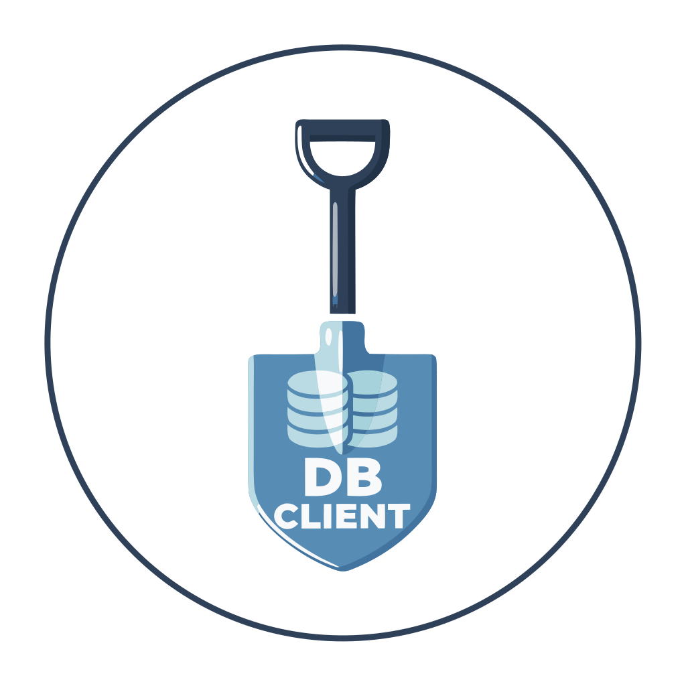

<p align="center">
  
</p>

<h1 align="center">Shovel</h1>


<p align="center">
  A native desktop database client built with Rust and Dioxus.
  <br />
  Persistent database chat threads, fast query workflows, and AI-assisted SQL through ACP.
</p>

<p align="center">
  SQLite • PostgreSQL • MySQL • ClickHouse • Rust • Dioxus • ACP • Ollama
</p>

<p align="center">
  If Shovel saves you time, give the repo a star.
</p>

---

## Why Shovel

Most database clients are either heavy, web-first, or overloaded with enterprise UI noise.

Shovel is trying to be the opposite:

- native desktop app, not a browser tab pretending to be one
- chat-first database workflows with persistent threads
- fast for daily SQL work
- clear workspace with explorer, editor, results, history, and saved queries
- direct support for local AI agents through ACP
- modular Rust workspace instead of a monolith

It is built for people who want a responsive database tool that feels closer to an editor than to a dashboard.

## What It Can Do

| Area | What you get |
| --- | --- |
| Chat | Persistent database chat threads, context-aware prompts, SQL generation, streaming responses, agent-guided execution |
| Querying | Multi-tab SQL editor, query history, structure tabs, formatting, pagination |
| AI Autocomplete | Inline SQL completions (Zed-style), multi-provider (DeepSeek + CodeStral), streaming token display |
| Data exploration | Connection explorer, schemas/databases, tables, views, column loading |
| Result workflows | Sort, filter, inspect rows, JSON view, row details |
| Editing | Draft inserts, cell edits, deletes, apply/discard changes for editable table views |
| Import / export | CSV import, CSV/JSON/XLSX export |
| AI workflows | ACP agent panel, OpenCode via ACP registry, embedded Ollama/DeepSeek ACP bridges |
| UX | Compact desktop layout, dark/light theme, saved queries/snippets, tooltips |

## Database Support

| Database | Connect | Explore | Query | Export | Edit table rows |
| --- | --- | --- | --- | --- | --- |
| SQLite | Yes | Yes | Yes | Yes | Yes |
| PostgreSQL | Yes | Yes | Yes | Yes | Yes |
| MySQL | Yes | Yes | Yes | Yes | Yes |
| ClickHouse | Yes | Yes | Yes | Yes | Not yet |

## AI / ACP Support

Shovel includes an ACP client layer, embedded ACP bridges for DeepSeek and Ollama, and inline AI SQL autocompletion.

That means you can:

- connect an external ACP-compatible coding/database agent over `stdio`
- install and connect supported ACP registry agents such as OpenCode
- spawn an embedded DeepSeek or Ollama-backed ACP agent directly from the UI
- generate SQL against the active connection context
- send general database prompts and insert generated SQL into the editor
- get **inline SQL completions** as you type — just like Zed's inline assistant
  - Tab to accept, keep typing to ignore
  - Streaming tokens appear in real-time
  - Multi-provider fallback (DeepSeek → CodeStral)
  - Schema-aware: completions know your tables and columns

This is opt-in. If you do not care about AI features, Shovel still works as a regular database client.

## Quick Start

### Requirements

- Rust stable
- for desktop builds: system dependencies required by Dioxus Desktop/WebView on your platform
- on Windows for raw `.exe`: Microsoft Edge WebView2 Runtime

### Run the desktop app

```bash
cargo run -p app --features desktop
```

### Build a release binary

```bash
cargo build -p app --release --features desktop
```

### Build a Linux release package artifact

GitHub Actions can build a Linux desktop tarball from `.github/workflows/linux.yml`.

The archive contains:

- `bin/shovel`
- desktop entry
- app icon
- README

### Build a Windows bundle

```bash
dx bundle --release --platform desktop --package app --features bundle --package-types msi
```

## Installation

Release artifacts are published here:

- [GitHub Releases](https://github.com/Fynth/shovel/releases)

### Ubuntu / Debian via APT repository

If the APT repository has already been configured on the machine, installation is just:

```bash
sudo apt update
sudo apt install shovel
```

To add the repository first:

```bash
echo "deb [arch=amd64 trusted=yes] https://fynth.github.io/shovel/apt stable main" | sudo tee /etc/apt/sources.list.d/shovel.list
sudo apt update
sudo apt install shovel
```

Notes:

- this currently targets `amd64`
- the repository is currently unsigned, so the source line uses `trusted=yes`

### Ubuntu / Debian via downloaded `.deb`

Download the latest Debian package from:

- [Latest Releases](https://github.com/Fynth/shovel/releases/latest)

Then install it with:

```bash
sudo apt install ./shovel_<version>_amd64.deb
```

or:

```bash
sudo dpkg -i shovel_<version>_amd64.deb
sudo apt -f install
```

### Arch Linux / EndeavourOS / Manjaro via AUR

Available AUR packages:

- `shovel`
- `shovel-bin`
- `shovel-git`

Install with:

```bash
yay -S shovel
```

or:

```bash
yay -S shovel-bin
```

or:

```bash
yay -S shovel-git
```

### Linux via Flatpak bundle

Download the Flatpak bundle from:

- [Latest Releases](https://github.com/Fynth/shovel/releases/latest)

Then install and run it with:

```bash
flatpak install --user ./shovel-linux-x86_64.flatpak
flatpak run dev.shovel.app
```

### Linux via release tarball

Download the Linux archive from:

- [Latest Releases](https://github.com/Fynth/shovel/releases/latest)

Then unpack and run:

```bash
tar -xzf shovel-linux-x86_64.tar.gz
./bin/shovel
```

The archive contains:

- `bin/shovel`
- `lib/shovel/assets/app.css`
- desktop entry
- app icon

### Windows

Download from:

- [Latest Releases](https://github.com/Fynth/shovel/releases/latest)

Available artifacts:

- `shovel-windows-x86_64.exe`
- Windows `.msi` installer

Notes:

- for raw `.exe`, Microsoft Edge WebView2 Runtime is required
- `.msi` is the better option for end-user installation

### Build from source

Requirements:

- Rust stable
- platform desktop dependencies required by Dioxus Desktop/WebView

Run directly:

```bash
cargo run -p app --features desktop
```

Build release binary:

```bash
cargo build -p app --release --features desktop
```

## AUR

This repo includes two AUR packaging paths:

- `packaging/aur/shovel-git/` for a VCS package that tracks the repository head
- `packaging/aur/shovel/PKGBUILD.in` plus `scripts/render-aur-release-package.sh` for a stable `shovel` package generated from release tags
- `packaging/aur/shovel-bin/PKGBUILD.in` plus `scripts/render-aur-binary-package.sh` for a binary `shovel-bin` package generated from GitHub release assets

Once the packages are published to AUR, install with:

```bash
yay -S shovel
yay -S shovel-bin
yay -S shovel-git
```

Update with:

```bash
yay -Syu
```

### Automatic AUR updates on each release

The workflow `.github/workflows/aur-publish.yml` pushes fresh `PKGBUILD` and `.SRCINFO` metadata to the AUR repositories `shovel.git` and `shovel-bin.git` every time a GitHub release is published.

One-time setup:

1. Create an AUR account.
2. Generate an SSH key dedicated to AUR publishing.
3. Add the public key to your AUR account.
4. Add the private key to this GitHub repository as the Actions secret `AUR_SSH_PRIVATE_KEY`.
5. Publish a GitHub release like `v0.1.5`, or run the workflow manually with the version input.

After that, each new published release updates the AUR package automatically.

Notes:

- `shovel` is the stable source package built from the tagged source tarball
- `shovel-bin` installs the prebuilt Linux release artifact and is the fastest option on AUR
- `shovel-git` is still useful if you want AUR users to track the latest commit instead of tagged releases
- `.github/workflows/aur-check.yml` verifies the tracked `shovel-git` metadata and smoke-tests the generated stable and binary package metadata

## Windows CI

GitHub Actions includes a Windows packaging workflow:

- `.github/workflows/main.yml`

It can build:

- raw Windows `.exe` artifact
- `.msi` installer artifact

Linux and Arch workflows:

- `.github/workflows/linux.yml`
- `.github/workflows/arch-repo.yml`
- `.github/workflows/apt-repo.yml`
- `.github/workflows/aur-check.yml`

Notes:

- the raw `.exe` build is the fastest path for testing
- the `.msi` bundle uses Dioxus bundling and is the better option for end-user distribution

## APT Repository

This repo now includes Debian packaging and a GitHub Pages-backed APT repository workflow:

- `.github/workflows/apt-repo.yml`
- `scripts/build-deb-package.sh`
- `scripts/build-apt-repo.sh`

The workflow builds a `shovel` package and publishes an `amd64` APT repository under:

```bash
https://<owner>.github.io/<repo>/apt
```

To install from the published repository:

```bash
echo "deb [arch=amd64 trusted=yes] https://<owner>.github.io/<repo>/apt stable main" | sudo tee /etc/apt/sources.list.d/shovel.list
sudo apt update
sudo apt install shovel
```

Notes:

- the initial repository is unsigned, so the source line uses `trusted=yes`
- runtime dependencies target Ubuntu 24.04 / Debian-family systems with `webkit2gtk-4.1`
- each `v*` release publishes both the `.deb` asset and refreshed APT metadata

## Flatpak Bundle

This repo also includes a Flatpak release workflow:

- `.github/workflows/flatpak.yml`
- `packaging/flatpak/dev.shovel.app.yml`
- `scripts/build-flatpak-bundle.sh`

Each `v*` release publishes a `shovel-linux-x86_64.flatpak` bundle to GitHub Releases.

## Project Layout

Shovel is organized as a Rust workspace with focused crates instead of one large application crate.

| Crate | Responsibility |
| --- | --- |
| `app` | desktop launcher, build pipeline, embedded ACP agent entrypoint |
| `ui` | Dioxus desktop frontend, AI autocomplete, chat |
| `models` | shared domain models and settings |
| `services` | unified facade — single entry point for `ui` into all lower crates |
| `connection` / `connection-ssh` | connection orchestration and SSH support |
| `explorer` | schema and object discovery |
| `query` | query execution, pagination, editable rows, formatting, import/export |
| `acp-core` / `acp` / `acp-registry` | ACP runtime, DeepSeek/Ollama agents, registry integration |
| `driver-*` | database-specific implementations (SQLite, PostgreSQL, MySQL, ClickHouse) |
| `storage` | local persistence for settings, sessions, history, saved queries, chat |

## What Makes It Different

- Native UI with Rust and Dioxus instead of Electron
- AI integration built around ACP instead of a one-off prompt box
- Inline SQL autocomplete like Zed — multi-provider, streaming, schema-aware
- Editable result grid for real table workflows, not just read-only browsing
- Workspace split into independent crates, which makes the codebase easier to evolve
- Feature-gated database drivers — build only what you need

## Current Status

Shovel is actively evolving.

Today it is already useful for:

- running queries quickly
- exploring local and remote databases
- editing SQLite/PostgreSQL/MySQL table data
- exporting/importing common formats
- using ACP-powered assistants for SQL generation (DeepSeek, Ollama, OpenCode)
- AI inline SQL autocompletion with streaming responses

Areas that still need expansion:

- deeper ClickHouse edit workflows
- broader packaging polish across platforms
- more agent presets and richer ACP UX

## Contributing

Issues, UX feedback, database-specific bugs, and performance reports are useful.

If you open a bug report, include:

- database type and version
- the query or workflow that failed
- expected behavior
- actual behavior
- platform (`Linux`, `macOS`, `Windows`)

## Vision

The long-term goal is straightforward:

> make a database client that feels fast, local, hackable, and AI-native without turning into a bloated IDE.

If that direction matches what you want from a desktop database tool, star the repo and follow the project.
